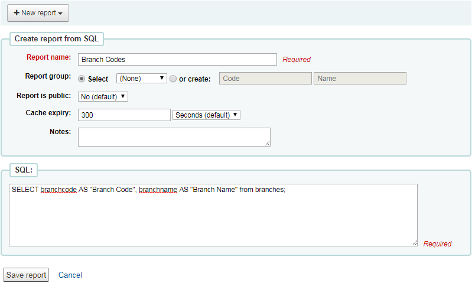
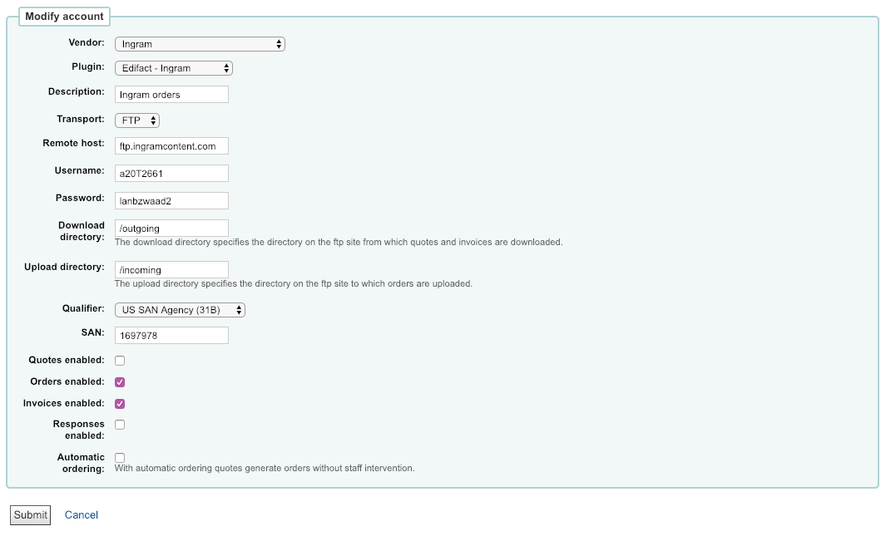
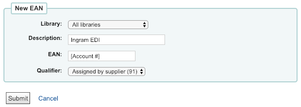
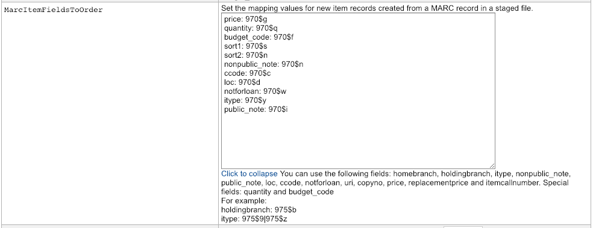
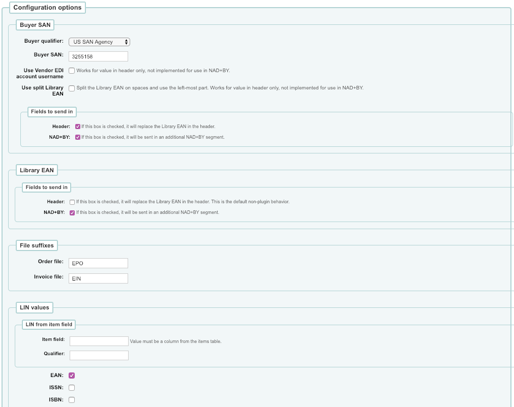
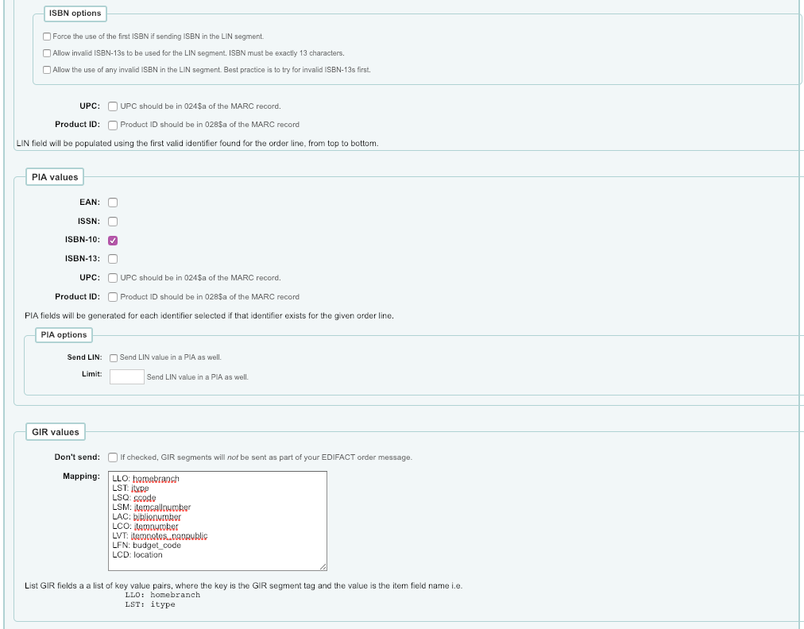
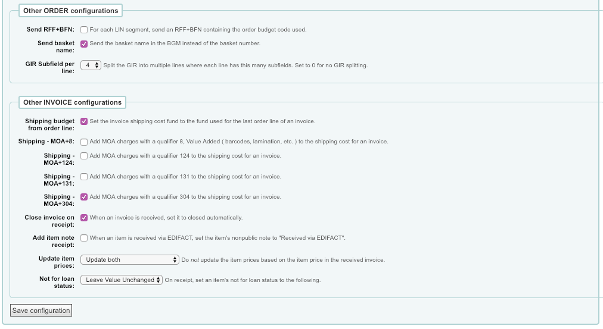

= Ingram EDI setup for Koha
Lory Koch, Kyle Hall, Andrew Fuerste-Henry
:toc:
:icons: font
:source-highlighter: rouge
:title-logo-image: cover.png

{docdate}

Lory Koch <lory.koch@ingramcontent.com> +
Kyle Hall <kyle@bywatersolutions.com> +
Andrew Fuerste-Henry <andrew@bywatersolutions.com> +

The latest version of this document is available as https://github.com/bywatersolutions/koha-plugin-edifact-enhanced/blob/ingram/INSTALLATION/INSTALLATION.pdf[PDF] and https://github.com/bywatersolutions/koha-plugin-edifact-enhanced/blob/ingram/INSTALLATION/INSTALLATION.adoc[on the web].

== Send Koha codes to Ingram

* Select _Reports_ from the _More_ drop-down menu in Koha
* Click _Create from SQL_ in the _Guided Reports_ section of the _Reports_ page
* Enter _Report Name_ and _Select statement_ for each of the reports listed below
* Save and run each report
* Download results in _comma separated text_ format and attach to email to your customer care associate at Brodart Company

.Example report

* Report Name: *Branch Codes*
** `+SELECT branchcode AS "Branch Code", branchname AS "Branch Name" from branches;+`
* Report Name: *Collection Codes
*
** `+SELECT authorised_value AS "Collection Code", lib AS "Collection Name" FROM authorised_values WHERE category = 'CCODE';+`
* Report Name: *Shelving Location Codes*
** `+SELECT authorised_value AS "Shelving Location Code", lib AS "Shelving Location Name" FROM authorised_values WHERE category = 'LOC';+`
* Report Name: *Item Type Codes*
** `+SELECT itemtype AS "Item Type Code", description AS "Item Type Name" FROM itemtypes;+`
* Report Name: *Fund Codes*
** `+SELECT budget_code AS "Fund Code", budget_name AS "Fund Name" FROM aqbudgets GROUP BY budget_code ORDER BY timestamp DESC;+`

== Install the Ingram EDI plugin for Koha

* Open the link https://github.com/bywatersolutions/koha-plugin-edifact-enhanced/releases in a web browser.
* Locate most recent _koha-plugin-edifact-enhanced-ingram_ plugin
* Click the _kpz_ file to Download
* In Koha, Select _Administration_ from the _More_ drop-down menu
* Click _Manage plugins_ in the Plugins section of the Administration Page
* Click the _Upload plugin_ button
* Click the _Choose File_ button
* Select the plugin file you just downloaded and click the _Open_ button.
* Click the _Upload_ button
* You should now see a new plugin named _Edifact - Ingram_

== Create an Ingram Vendor Record

* Select _Administration_ from the _More_ drop-down menu in Koha
* Click _EDI accounts_ in the Acquisition parameters section of the Administration page
* Click the _New Account_ button
* Select _Ingram_ as the Vendor
* Select _Edifact – Ingram_ as the Plugin
* Select _FTP_ as the Transport
* Enter _ftp.ingramcontent.com_ as the Remote host
* Enter the _username_ and _password_ provided by Ingram
* Enter _/outgoing_ as the Download directory
* Enter _/incoming_ as the Upload directory
* Select _US SAN Agency (31B)_ as the Qualifier
* Enter _1697978_ as the SAN ( Ingram's _Standard Address Number_ )
* Check _Order enabled_
* Check _Invoices enabled_

.EDI vendor record creation form

== Create Ingram Account Records (EANs)


Create an EAN for each unique Ingram account number.

* Select _Administration_ from the _More_ drop-down menu in Koha
* Click _Library EANs_ in the Acquisition parameters section of the Administration page
* Click the _New EAN_ button
* If this EAN is to be used by just one library within your system, select that library from the library pulldown
* Enter a Description of the Ingram account to be used 
* Enter an Ingram account number as the EAN. This account number should start with "20"
* Select _Assigned by supplier (91)_ as the Qualifier

.Library EAN creation form

== Create MARC Record Import Map

* Select “Administration” from the “More” drop-down menu in Koha
* Click “Global system preferences” on the Administration page
* Click the “Click to Edit” hyperlink in the field to the right of “MarcItemFieldsToOrder”
* Enter the MARC to item field mappings established in your Ingram grid setup
* These values may differ per library but will follow this format:
+
....
price: 970$g
quantity: 970$q
budget_code: 970$f
sort1: 970$s
sort2: 970$n
nonpublic_note: 970$n
ccode: 970$c
loc: 970$d
notforloan: 970$w
itype: 970$y
public_note: 970$i
....
* Click “Save all Acquisitions preferences” button

.Koha system preference *MarcItemFieldsToOrder*

== Configure EDI plugin

* Browse to Administration => Manage Plugins
* Click the “Actions” button on the row for the “Edifact - Ingram” plugin, select the “Configure” option.
* Enter the following data into the plugin `Configuration options`:
** Buyer SAN
*** Buyer qualifier: US SAN Agency
*** Buyer SAN: Enter the buyer SAN Ingram has provided you
*** Fields to send in
**** Header: checked
** Library EAN
*** NAD+BY: checked
** File suffixes
*** Order file: epo
*** Invoice file: ein
** LIN values:
*** EAN: checked
** ISBN options
*** Force the user of the first ISBN if sending ISBN in the LIN segment: checked
** PIA values
*** ISBN-10: checked
** GIR values:
*** Mapping
+
....
LLO: homebranch
LST: itype
LSQ: ccode
LSM: itemcallnumber
LAC: biblionumber
LCO: itemnumber
LVT: itemnotes_nonpublic
LFN: budget_code
LCD: location
....
** Other ORDER configurations
*** Send basket name: checked
** Other INVOICE configurations
*** Shipping budget from order line: checked
*** Shipping - MOA+304: checked
*** Close invoice on receipt: checked _(optional)_
*** Add item note receipt: checked _(optional)_
* Click _Save Configuration_ button.

.Plugin configuration, 1 of 3

.Plugin configuration, 2 of 3

.Plugin configuration, 3 of 3

== Ingram to Koha and EDI Release Workflow

* Download the On Order records from Ingram
* In Koha, ensure the system preference _AcqCreateItem_ option set to _placing an order_
* Create the basket in Koha
* Stage on order records in Koha
* Add records from staged file to basket
* Save the imported records and double check the basket totals match the cart in Ingram
* Submit EDI order from Koha
* Delete the cart from Ingram’s site.
 
